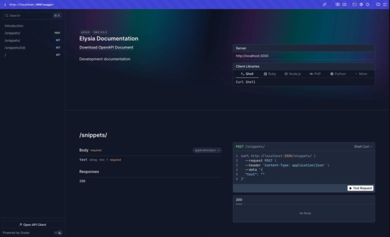

# AI Snippet Service

## 01. Introduction

This software solution is a test software I built based on the objective that: "Content teams often need a quick way to paste in raw text (blog drafts, transcripts, etc.) and get back short, AI-generated summaries they can reuse elsewhere."




---

## 02. The Stories

### 01. Background Story

Though, initially, the main task was to build a back-end for such a service, I decided to challenge myself build an end-to-end full-stack software solution product around the back-end.

Therefore, my process was to

1. Start with a plan like a Technical Product Manager to plan the project at a product level.

2. Execute the plan as a Product Designer & a Software Engineer. Which involves to:

   1. Design the solution like a software architect. Which includes adopting a BDD + TDD methodology, a Remix + Elysia stack (both written in TypeScript). And, FYI🤓, I crafted the stack based on a balance between:

      - Product performance
      - Product Cost
      - My proficiency
      - My time efficiency

   2. Plan the Implementation `around the user stories.

   3. Design the UI, and Develop the software.

   4. Deploy it to the market.

### 02. Reflection Story

So, to summarize how that went: as much as I thought I would knock this off in a little time, like 6 hours, especially because I decided to use a modular monolith architecture, which involves me using Nx, deciding to use Remix, which I just found preferable for some sort of application that the Next.js I was more proficient in, and deciding to use Prisma instead of Mongoose for the DRM, since I believe an ORM or DRM should be something that works with more range of databases, since that one of the main reasons of using it, so with all these, which created more gaps, I spent more time than initially thought, but, I enjoyed the whole process all the way.

And, definitely, just like most projects, there were more things I would like to incorporate:

- Optimize the docker builds further
  - Move running test on the production docker to either a CI pipeline or docker build so it doesn't require me to copy the source files and keep the node_modules
  - Use a custom server for Remix so it doesn't also require the node_modules in the container
  - Try to further reduce the image size with tools like slim
- Add a CI pipeline
- Do more code optimizations
- Etc.

But, being agile, the goal is to build in meaningful iterations rather than a giant waterfall.

---

## 03. How to Setup the application

### 01. Prerequisites

- Node.js (>= 22.17.0)
- pnpm (>= 10.x)
- MongoDB (Atlas) Database
- OpenAI API key

### 02. Set up the repository

1. Clone the repository:

   ```sh
   git clone https://github.com/codescype/test-ai-snippet-service.git
   cd test-ai-snippet-service
   ```

2. Install dependencies:

   ```sh
   pnpm install
   ```

3. Set up environment variables

Create an `.env` file in the root directory and fill in the variables in the `.env.example` file.

## 05. How to Run the Application

### 01. Run the app locally

#### 01. (Optionally) Seed the Database

#### 02. Test the Applications

```sh
pnpm nx run server:test
```

> [!note]
> I wrote tests for the server app alone, since that's the focus.

#### 03. Run the apps in Development

##### 01. Generate the Prisma Schema

```sh
pnpm nx run server:prisma-generate
```

##### 02. Run all the apps at once

```sh
pnpm nx run-many --target=dev --projects=server,client
```

- Access the server app on http://localhost:3000
- Access the client app on http://localhost:3030

> [!tip]
> If you run the client alone with `pnpm nx run client:dev`,
> it will automatically start the server
> since my configuration tells nx the client relies on the server 😉.

#### 04. Run the apps in production

##### 01. Build the Applications & library

```sh
pnpm nx run-many --target=build --all
```

##### 02. Start the applications

```sh
pnpm nx run-many --target=start --projects=server,client
```

#### 02. Or Use docker

##### 01. Copy .env

Copy `.env` to `docker/.env`

##### 02. Build and Run docker

- It runs the tests (which is technically the server app for now).
- Builds the apps
- And, starts the apps

```sh
docker-compose -f docker/docker-compose.yml up --build
```

> [!note]
> I configured the Docker to run separate containers using a shared Dockerfile. So, each container can scale as need be.
> And, the container runs a test before starting the server app. Which would exit the container if the test fails.

- Access the server app on http://localhost:3000
- Access the client app on http://localhost:3030
